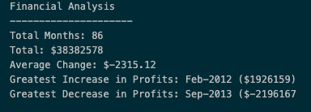
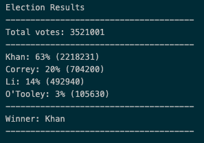

# Financial and Poll Analysis 

The first project was focused on creating a python script for analyzing financial records of a company, specifically the following points:

* The total number of months included in the dataset
* The net total amount of "Profit/Losses" over the entire period
* The average of the changes in "Profit/Losses" over the entire period
* The greatest increase in profits (date and amount) over the entire period
* The greatest decrease in losses (date and amount) over the entire period

The second project uses python to help a small, rural town modernize its vote counting process. Specifically, the analysis is focused on calculating each of the following:

* The total number of votes cast
* A complete list of candidates who received votes
* The percentage of votes each candidate won
* The total number of votes each candidate won
* The winner of the election based on popular vote.

## Data 

* The dataset used for the first project is composed of two columns: Date and Profit/Losses.
* The dataset used for the second project is composed of three columns: Voter ID, County, and Candidate.

## Features

* Data analysis with python
* Summary reports

## Built with 

* Python

## Outcomes

Financial analysis

Election results

